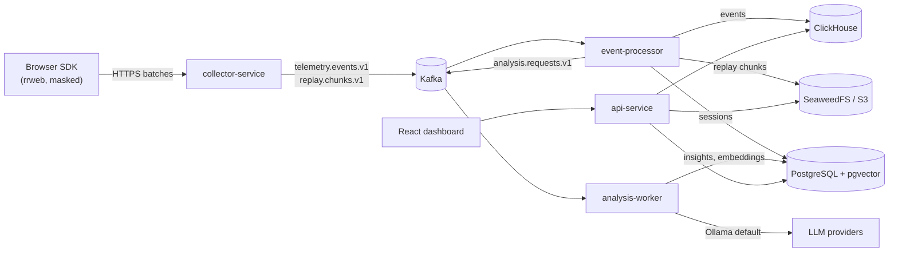

# Session Insights

Open-source, self-hostable session replay and product insights platform.
Record user sessions, replay them, detect friction automatically, and let a local LLM
triage problem sessions, with humans reviewing anything uncertain.

> **Status:** Milestone M0 complete (local stack + build verified). Working towards M1: schemas (Phase 1), the
> collector API → Kafka (Phase 2) and the browser SDK (Phase 3) are done; sessions are recorded and reach
> Kafka, but nothing consumes them yet (event processing is next).
> See [Roadmap](#roadmap).

## Architecture



| Service | Port | Role |
|---|---|---|
| `collector-service` | 8081 | Stateless ingestion edge → Kafka |
| `event-processor` | 8082 | Kafka → ClickHouse / S3 / PostgreSQL, session lifecycle |
| `analysis-worker` | 8083 | Signal gating, LLM analysis, guardrails |
| `api-service` | 8080 | Dashboard + human review (HITL) API |

Why these choices: see [`docs/adr`](docs/adr). What "done" means: see
[`docs/requirements.md`](docs/requirements.md).

## Quick start (local)

**Prerequisites:** Docker with Compose v2 (8 GB+ memory for Docker), JDK 21, Maven 3.9+,
`curl`, `python3`, and Ollama.

```bash
# 1. LLM — macOS: run natively (uses the Apple GPU). Keep `ollama serve` running.
brew install ollama && ollama serve
ollama pull qwen2.5:7b && ollama pull nomic-embed-text

# 2. Dependencies
cp .env.example .env
docker compose up -d
./scripts/verify-stack.sh     # must report 0 failures

# 3. Build
mvn -q verify
```

Linux / CI (Ollama in Docker): `docker compose --profile ollama-docker up -d`
(add `-f docker-compose.gpu.yml` with an NVIDIA GPU).
Low on RAM? Set `OLLAMA_CHAT_MODEL=qwen2.5:3b` in `.env` and pull it.
Browse Kafka: `docker compose --profile tools up -d` → http://localhost:8085.

| Dependency | Host endpoint |
|---|---|
| Kafka | `localhost:9092` |
| PostgreSQL | `localhost:5432` (db/user from `.env`) |
| ClickHouse | HTTP `localhost:8123`, native `localhost:9000` |
| S3 (SeaweedFS) | `http://localhost:8333` |
| Ollama | `http://localhost:11434` |

Reset everything: `docker compose down -v`.

### Run the collector (Phase 2)

```bash
mvn -q install -DskipTests
# once: api-service applies the migrations (creates the insights_collector role) and,
# with the dev profile, seeds a tenant/site and prints the dev site key once
mvn -q -pl services/api-service spring-boot:run -Dspring-boot.run.profiles=dev
# then, in another terminal
mvn -q -pl services/collector-service spring-boot:run      # http://localhost:8081

curl -i 'http://localhost:8081/v1/events?k=<dev site key>' \
  -H 'Origin: http://localhost:3000' -H 'Content-Type: text/plain' \
  -d '{"sessionId":"'$(uuidgen)'","events":[{"clientEventId":"'$(uuidgen)'","type":"CLICK","ts":'$(date +%s000)'}]}'
```

`202` means every event was acknowledged by Kafka (`telemetry.events.v1`). Replay chunks go
to `POST /v1/replay`. Browser clients always send the key as `?k=`; the `X-SI-Key` header is
for non-browser clients only. A browser `Origin` on the site's allow-list is required
(ADR-0010).

### Record a session with the SDK demo (Phase 3)

With compose up, the dev tenant seeded once (above) and the collector running:

```bash
./scripts/dev-site-key.sh                       # rotates the dev key into examples/demo-site/.env.local
(cd sdk && npm ci && npm run build)             # Node 24 (sdk/.nvmrc)
(cd examples/demo-site && npm ci && npm run dev) # http://localhost:5173
```

Type, click and navigate on the demo page; batches arrive on `telemetry.events.v1` and
`replay.chunks.v1`. Passwords, card fields, one-time codes and `data-si-block` content are
never recorded; see [`sdk/README.md`](sdk/README.md). The end-to-end privacy test runs the
same flow in Chromium and checks what reached Kafka:

```bash
./scripts/e2e-sdk.sh
```

## Repository layout

```
docs/               product features, roadmap, requirements, ADRs, phase prompts
infra/              config for local dependencies (Kafka topics, DB init, S3 identities)
services/           Java services (Maven multi-module)
  platform-common/  shared contracts (topic names, event records)
sdk/                browser SDK (TypeScript)
contracts/          wire contract fixtures shared by the SDK and collector tests
examples/demo-site/ local demo page for the SDK
dashboard/          analyst UI (React) — Phase 5+
scripts/            developer tooling
```

## Roadmap

Feature-first milestones; details in [`docs/roadmap.md`](docs/roadmap.md), features and
acceptance criteria in [`docs/product/features.md`](docs/product/features.md).

| Milestone | Demo | Status |
|---|---|---|
| M0 Foundation | Stack + build green | ✅ |
| M1 First replay | SDK on a demo page → replay in dashboard | ⏳ Phases 1–6 |
| M2 Find the pain | Filter rage clicks, jump to the moment | ⏳ Phases 7–8 |
| M3 AI triage | Local-LLM summary, human review queue | ⏳ Phases 9–10 |
| M4 v1.0 | Admin, erasure, hardening, release | ⏳ Phases 11–12 |
| M5 v2 | Session → ITSM ticket, alerts, funnels… | ⏳ |

How we build (branch per phase, PRs, Claude Code): [`docs/WORKFLOW.md`](docs/WORKFLOW.md).

## License

[Apache License 2.0](LICENSE).
